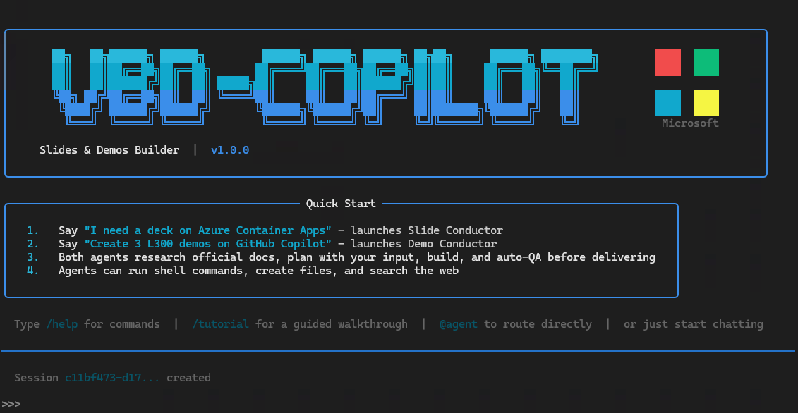
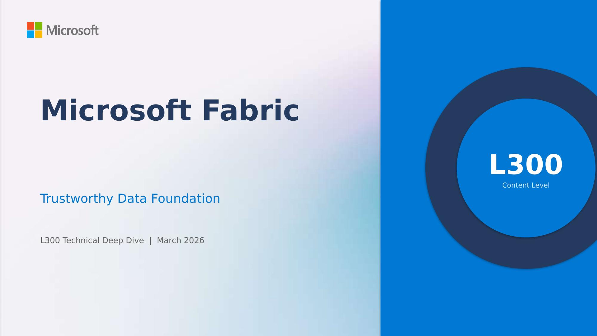
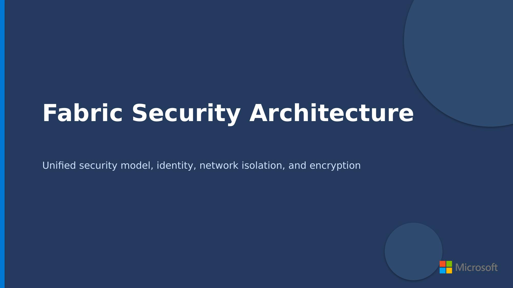
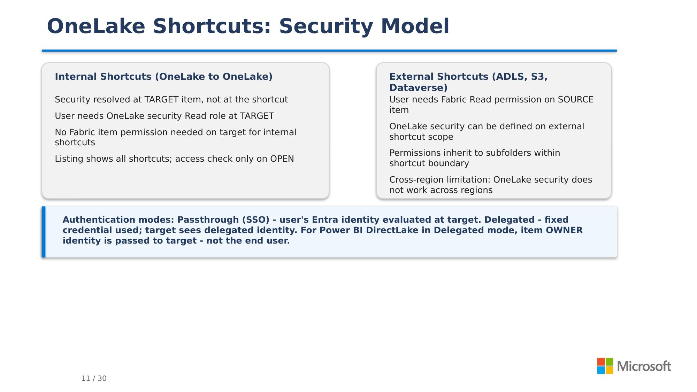
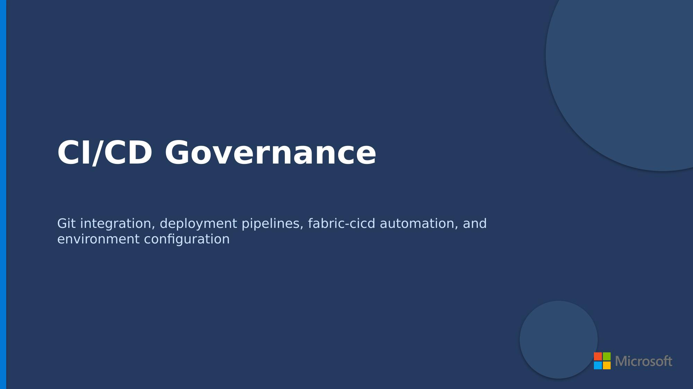

# VBD-Copilot - Slides & Demos Builder

> AI-powered presentation and demo builder for Microsoft Cloud Solution Architects and Solution Engineers



---

## Quick Index

- [VBD-Copilot - Slides \& Demos Builder](#vbd-copilot---slides--demos-builder)
  - [Quick Index](#quick-index)
  - [What This Is](#what-this-is)
  - [Sample Output](#sample-output)
  - [Architecture](#architecture)
  - [Content Levels](#content-levels)
  - [Slide Session Durations](#slide-session-durations)
  - [Prerequisites](#prerequisites)
  - [Getting Started](#getting-started)
    - [One-time setup: authenticate the Copilot CLI](#one-time-setup-authenticate-the-copilot-cli)
    - [Option A - Docker (recommended)](#option-a---docker-recommended)
    - [Option B - GitHub Codespaces (zero install)](#option-b---github-codespaces-zero-install)
    - [Option C - Native install](#option-c---native-install)
  - [Usage Examples](#usage-examples)
    - [Generate a presentation](#generate-a-presentation)
    - [Generate demo guides](#generate-demo-guides)
    - [Direct @mentions](#direct-mentions)

---

## What This Is

CSAs and Solution Engineers spend hours assembling custom presentations and demo scripts for every customer session. Official decks are too generic, too old, or built for a different audience. Demo scripts are scattered and undocumented.

This textual user interface app gives you two AI conductors that produce customer-ready technical content on any topic, calibrated to your customer's level and context:

- **Slide Conductor** - generates a complete `.pptx` presentation with speaker notes from a single prompt
- **Demo Conductor** - generates a full step-by-step demo guide with all runnable companion scripts

Both conductors research official docs first, plan with your input, build, and run automated quality review before delivering output.

> [!IMPORTANT]
> **This is a slow, thorough process.** Generating a full slide deck typically takes **1 hour or more** depending on topic complexity, content level, and session duration. Longer sessions (2h+) or higher content levels (L300/L400) can take even longer. Demo generation is usually faster but still expects 30-45 minutes. Plan accordingly - kick off a generation and let it run.

> **Accelerator, not autopilot.** Always review generated content before a customer session. Treat output as a strong first draft you own and refine. Feedback welcome.

---

## Sample Output

The slides and demos below - **un-edited on purpose** - were generated by the vbd-copilot utility of this repo.

| | | | |
|:---:|:---:|:---:|:---:|
|  |  |  |  |
| Title slide | Agenda / section intro | Technical deep dive | Architecture pattern |

*From: Microsoft Fabric - Trustworthy Data (L300, 2h) - generated by Slide Conductor*

Browse the full output library:

- [samples/slides/](samples/slides/README.md) - generated `.pptx` decks and generator scripts
- [samples/demos/](samples/demos/README.md) - generated demo guides and companion scripts

---

## Architecture

```text
+-----------------------------------------------------------------+
|  User Input                                                     |
|  "@slide-conductor I need a 1h L300 deck on Azure Container Apps"|
+-----------------------+-----------------------------------------+
                        |
                        v
+-----------------------------------------------------------------+
|  router.py - Agent Router                                       |
|  Detects "deck" keyword -> selects slide-conductor               |
+-----------------------+-----------------------------------------+
                        |
                        v
+-----------------------------------------------------------------+
|  Conductor Agent (top-level, infer=True)                        |
|                                                                 |
|  slide-conductor:                                               |
|    0. Pre-research + clarify                                    |
|    1. Deep research (parallel shards)                           |
|    2. Create plan -> user approval                              |
|    3. Build PPTX (fragments -> assemble -> run)                 |
|    3F. PPTX QA (markitdown + visual inspection)                 |
|    4. Deliver .pptx + generator script                          |
|                                                                 |
|  demo-conductor:                                                |
|    0. Pre-research + clarify                                    |
|    1. Deep research                                             |
|    2. Create plan -> user approval                              |
|    3. Build guide + companion scripts                           |
|    4. Validate + review (syntax, URLs, content)                 |
|    5. Deliver guide + scripts                                   |
|                                                                 |
|  +-----------------------------------------------------------+ |
|  |  Sub-agents (infer=False, via delegation tools)            | |
|  |                                                           | |
|  |  research-subagent       demo-research-subagent           | |
|  |  slide-builder-subagent  demo-builder-subagent            | |
|  |  pptx-qa-subagent        demo-reviewer-subagent           | |
|  |                          demo-editor-subagent             | |
|  +-----------------------------------------------------------+ |
+-----------------------------------------------------------------+
```

## Content Levels

| Level | Audience | Description |
|-------|----------|-------------|
| **L100** | Business / Executive | Value propositions, no code |
| **L200** | Technical decision makers | Architecture, key concepts |
| **L300** | Practitioners | Implementation, code samples, best practices |
| **L400** | Experts | Internals, performance, advanced patterns |

## Slide Session Durations

| Duration | Approx. slides |
|----------|---------------|
| 15 min | 10-14 |
| 30 min | 15-20 |
| 1 hour | 25-35 |
| 2 hours | 40-55 |
| 4 hours | 70-90 |

## Prerequisites

- A **GitHub Copilot** subscription (Individual, Business, or Enterprise) with CLI access
- **One** of the following run methods:
  - **Docker** (recommended) - just Docker Desktop / Docker Engine
  - **GitHub Codespaces** - nothing to install, runs in the browser
  - **Native** - Python 3.11+, LibreOffice Impress, Poppler, and the GitHub Copilot CLI on your machine

## Getting Started

### One-time setup: authenticate the Copilot CLI

Before using any run method, you need a local Copilot CLI session. If you already use GitHub Copilot in VS Code or the CLI, you may already be authenticated.

```bash
# Install (if not already present)
gh extension install github/gh-copilot

# Sign in - opens a browser for device-flow auth
gh auth login
gh copilot --version          # confirms it works
```

This creates auth tokens under `~/.copilot/` on your machine.

---

### Option A - Docker (recommended)

The Docker image bundles Python, LibreOffice, Poppler, and all pip dependencies. Nothing else to install.

```bash
# Clone the repo
git clone https://github.com/<your-org>/vbd-copilot.git
cd vbd-copilot

# Build the image (first time only, ~1 GB)
docker build -t vbd-copilot .

# Run the TUI
docker run -it --rm \
  -v ~/.copilot:/home/app/.copilot:ro \
  -v "$(pwd)/outputs:/app/outputs" \
  vbd-copilot
```

| Mount | Purpose |
|-------|---------|
| `~/.copilot` -> `/home/app/.copilot` | Shares your Copilot auth tokens (read-only) |
| `./outputs` -> `/app/outputs` | Generated `.pptx`, demo guides, and scripts persist on your host |

> [!TIP]
> Add an alias for convenience:
>
> ```bash
> alias vbd='docker run -it --rm -v ~/.copilot:/home/app/.copilot:ro -v "$(pwd)/outputs:/app/outputs" vbd-copilot'
> ```
>
> Then just run `vbd` from inside the repo.

---

### Option B - GitHub Codespaces (zero install)

If you don't want to install anything locally, open the repo in a Codespace. The dev container installs all system and Python dependencies automatically.

1. Go to the repo on GitHub and click **Code** -> **Codespaces** -> **Create codespace on main**
2. Wait for the container to build (~2-3 minutes the first time)
3. In the Codespace terminal, run:

```bash
python app.py
```

That's it - LibreOffice, Poppler, and all Python packages are pre-installed by the dev container.

> [!NOTE]
> Codespaces requires a GitHub plan with Codespaces minutes (free tier includes 60h/month for individual accounts).

---

### Option C - Native install

For users who prefer running directly on their machine without containers.

**System dependencies** (install once):

```bash
# Ubuntu / Debian
sudo apt-get update && sudo apt-get install -y libreoffice-impress poppler-utils

# macOS (via Homebrew)
brew install --cask libreoffice && brew install poppler

# Fedora / RHEL
sudo dnf install libreoffice-impress poppler-utils
```

**Python setup:**

```bash
cd vbd-copilot
python -m venv .venv && source .venv/bin/activate
pip install .
```

**Run:**

```bash
python app.py
```

---

## Usage Examples

### Generate a presentation

```text
>>> I need a 1-hour L300 deck on GitHub Copilot agent extensions for financial services
  >> routed -> slide-conductor | model: claude-sonnet-4.6

  ? Agent asks: I found these sub-areas from official docs...
  ...
  [Phase 0-4 proceeds automatically with approval stops]
  ...
  OK: Saved outputs/slides/gh-copilot-extensions-l300-1h.pptx (30 slides)
```

### Generate demo guides

```text
>>> Create 3 L300 demos on Azure Container Apps for Contoso
  >> routed -> demo-conductor | model: claude-sonnet-4.6

  ? Agent asks: What specific aspects should the demos cover?
  ...
  [Phase 0-5 proceeds automatically with approval stops]
  ...
  OK: Saved outputs/demos/contoso-aca-demos.md + 3 companion files
```

### Direct @mentions

```text
>>> @slide-conductor Make a 30min L200 deck on Microsoft Fabric
>>> @demo-conductor Build 2 demos on GitHub Actions for Zava Industries
```
