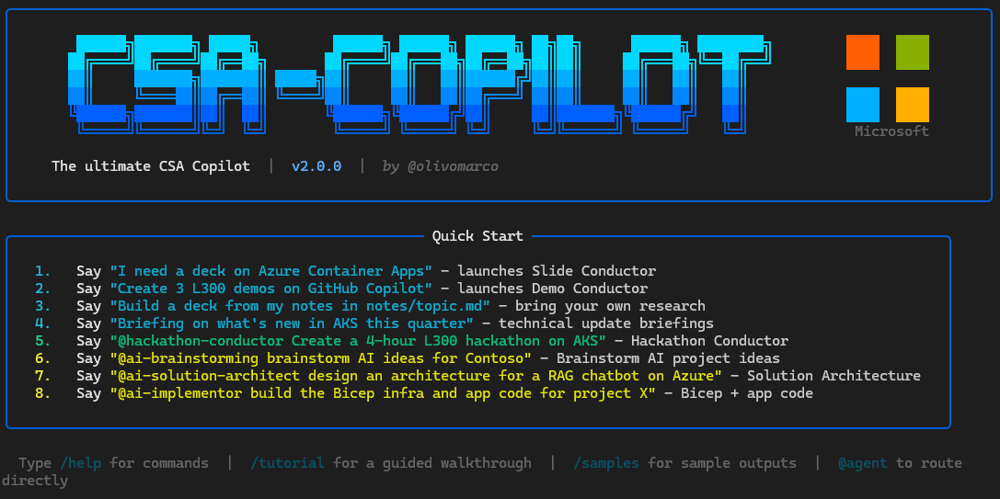
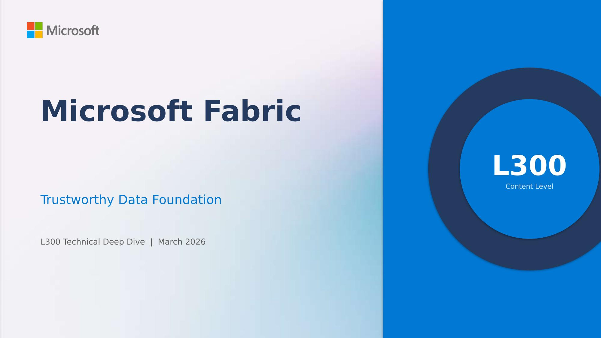
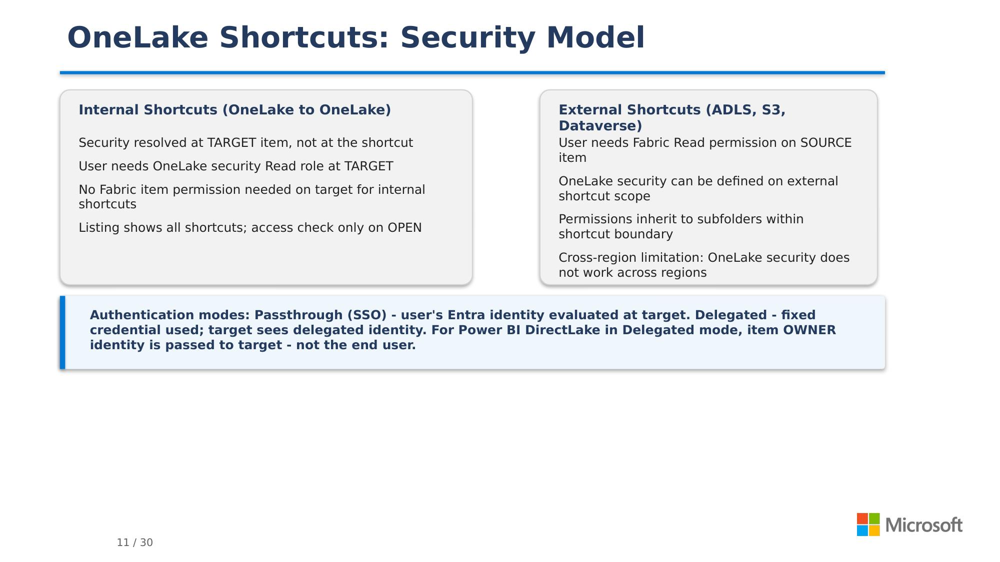
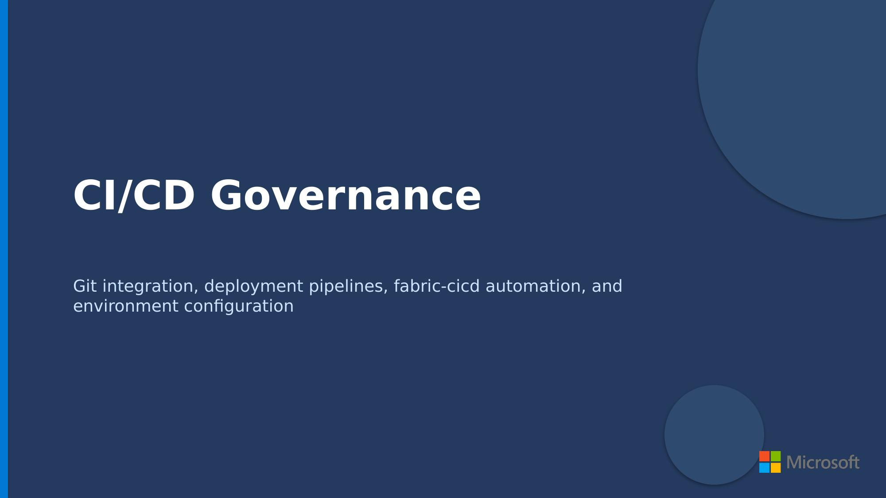

# CSA-Copilot

> AI-powered engagement platform for Cloud Solution Architects — from meeting prep to production-ready Azure delivery



---

## What This Is

Customer meeting on Wednesday, and you need a 45-slide deck on a service you last touched three months ago. The official deck is two releases behind. Your demo scripts live in five different OneNote pages. You'll spend tonight copy-pasting from MS Learn and wrangling PowerPoint.

CSA-Copilot kills that cycle. It's a terminal-based AI platform built on the GitHub Copilot SDK with **four workflows** — each run by a conductor agent that orchestrates specialist subagents, asks for your approval at key stops, and runs QA checks before delivering output. 27 agents behind the scenes; you just type a prompt.

1. **Presentations** — Complete `.pptx` with speaker notes from a single prompt, researched against official sources
2. **Demos** — Step-by-step guides with runnable scripts, troubleshooting tables, and "say this" presenter cues
3. **AI Projects** — Blank page → production-ready Azure project: brainstorm → architecture → Bicep + app code + CI/CD + tests, with a 4-reviewer gate
4. **Hackathons** — What-The-Hack-style packages with progressive challenges, coach materials, and dev containers

> [!IMPORTANT]
> **Deep research, not instant generation.** A slide deck takes **~1 hour**, demos 30-45 min, AI projects 1 hour+. That replaces 4-8 hours of manual work. Kick it off and do something else.
>
> **Accelerator, not autopilot.** Output is a strong first draft with sourced claims and tested code. You own it, refine it, present it.

---

## A Day in the Life

| Situation | Prompt | Result |
|-----------|--------|--------|
| Manager wants a tech update | "Create a 15min L200 briefing on what's new in AKS" | 12-slide deck with speaker notes from MS Learn + devblogs |
| Customer meeting needs deep coverage | "1-hour L300 deck on GitHub Copilot extensions for financial services" | 30 slides with presenter transcripts, plan approval before build |
| You already have research notes | "Build a 30min L200 deck from notes/aks-security-review.md" | Deck built from your material, not web research |
| Demo day for a customer | "Create 3 L300 demos on Azure Container Apps" | Guide + companion scripts + troubleshooting tables + "say this" boxes |
| Pre-sales brainstorm | "@ai-brainstorming AI use cases for a healthcare company" | 10+ ranked ideas with impact scores, Azure services, phased roadmap |
| Architecture engagement | "@ai-solution-architect Design architecture for idea #3" | 5 docs: solution design, diagrams, cost estimation, delivery plan |
| Delivery kickoff | "@ai-implementor Implement the solution" | Bicep + app code + CI/CD + tests (80% coverage gate), 4-reviewer approval |
| Continue yesterday's work | `/resume` | Full context restored — sessions survive across days |
| Partner enablement event | "@hackathon-conductor Full-day L300 hackathon on Container Apps" | Challenges + solutions + dev container + coach materials, repo-ready |

---

## Four Workflows

### 1. Presentations

The **Slide Conductor** researches official sources, presents a plan for your approval, builds slides with QA checks, and drops the `.pptx` + generator script into `outputs/slides/`. Also handles **technical update briefings** (what's new this quarter) and **slides from your own notes** (point it at a `.md` file).

### 2. Demos

The **Demo Conductor** produces a Markdown guide with runnable companion scripts → `outputs/demos/`. Each demo includes: step-by-step instructions, "say this" presenter cues, a WOW moment, a troubleshooting table, and companion `.sh`/`.py` scripts.

### 3. AI Projects — Idea to Production

Three conductor agents, each with mandatory quality gates:

| Stage | Agent | Output |
|-------|-------|--------|
| **Brainstorm** | `@ai-brainstorming` | 10+ ranked ideas with impact scores, Azure mappings, phased roadmap |
| **Architecture** | `@ai-solution-architect` | 5 docs: solution design, draw.io + ASCII diagrams, cost estimation, delivery plan |
| **Implementation** | `@ai-implementor` | Bicep infra + app code + CI/CD + tests (80% coverage gate). 4-reviewer approval required |

```text
outputs/ai-projects/{slug}/
  ├── docs/    infra/    src/    tests/    scripts/    .github/workflows/
```

### 4. Hackathon Events

The **Hackathon Conductor** creates What-The-Hack-style packages: progressive challenges, step-by-step coach solutions, dev container for Codespaces, facilitation guide, and scoring rubric.

| Duration | Challenges | Spread |
|----------|-----------|--------|
| 2 hours | 3-4 | setup → easy → medium |
| 4 hours | 5-6 | setup → easy → medium → hard |
| 8 hours | 8-10 | setup → easy → medium → hard → expert |

```text
outputs/hackathons/{event-slug}/
  ├── challenges/    solutions/    coach/    resources/    .devcontainer/
```

---

## Sample Outputs

Raw, un-edited output from CSA-Copilot — straight from the agents, so you know what to expect.

| | | | |
|:---:|:---:|:---:|:---:|
|  |  |  |  |
| Title slide | Section | Technical deep dive | Architecture pattern |

*From: Microsoft Fabric - Trustworthy Data (L300, 2h)*

Browse the full output library: [slides](samples/slides/README.md) · [demos](samples/demos/README.md) · [hackathons](samples/hackathons/README.md) · [AI projects](samples/ai-projects/README.md)

---

## Architecture

**Routing.** The router uses a two-step strategy. If you type `@agent-name`, the message goes directly to that agent. Otherwise, a lightweight GPT-4.1 classifier reads your prompt, compares it against all routable agent descriptions, and picks the best match. If neither approach finds a match, the default Copilot agent handles it as free-form conversation.

**Model selection.** When an agent is selected, the session automatically switches to that agent's preferred model. Slide and demo conductors use claude-sonnet-4.6. Brainstorming and architecture agents use claude-opus-4.6 for deeper reasoning. The implementor uses claude-sonnet-4.6 for speed. You can override anytime with `/model`.

---

## Quality and Trust

The whole point of this tool is producing content you can put in front of a customer without embarrassment. Several mechanisms work together to make that happen.

**Research from official sources only.** Every research subagent is restricted to MS Learn, docs.github.com, github.blog, devblogs.microsoft.com, and techcommunity.microsoft.com. No random blog posts, no Stack Overflow guesses, no made-up URLs. Every link in the output is real and was fetched during generation.

**Human approval stops.** Every conductor pauses after the research phase and presents a plan. You approve, modify, or reject it before any content gets built. You also review the final output before it's considered done.

**Automated QA checks.** Each workflow runs programmatic validation before delivery:

- **PPTX QA** - shape overflow detection, placeholder text scanning, speaker notes presence, font size validation, slide count verification
- **Architecture QA** - document completeness, Azure mandate compliance, placeholder-free content, diagram accuracy
- **Infrastructure QA** - Bicep syntax, module decomposition, Key Vault usage, managed identity for secrets, RBAC configuration
- **Pipeline QA** - YAML syntax, job dependencies, secrets via environment variables, deploy script safety
- **Documentation QA** - section completeness, path accuracy, command correctness, environment variable documentation
- **Hackathon QA** - sequential challenge numbering, required sections per challenge, matching solutions, coach materials, dev container validity, cross-reference consistency

**Content humanization.** Generated text goes through AI-tell detection that flags filler words, hedging phrases, uniform sentence structure, and a blacklist of overused AI vocabulary. A humanity scoring system rates the output and triggers rewrites if the score is too low. The goal is content that reads like a person wrote it, not a chatbot.

**4-reviewer gate for AI projects.** The implementor cannot deliver until four independent specialist reviewers (code, infra, pipeline, docs) each return APPROVED. If any one of them flags an issue, targeted fixes are applied and that reviewer runs again. No shortcuts.

**80% test coverage.** Code projects must pass a `pytest --cov` threshold of 80% before the code reviewer will approve.

---

## Observability and Cost Tracking

CSA-Copilot tracks token usage, timing, and estimated costs in a local SQLite database at `~/.csa-copilot/csa-copilot.db`. Nothing leaves your machine.

**What gets tracked:**

- Input and output tokens per turn, including cache reads and writes
- Estimated USD cost per turn (based on published model pricing)
- Tool call and subagent invocation counts
- Session duration, turn count, and agent/model per session

**How to access it:**

| Command | What it shows |
|---------|--------------|
| `/usage` | Current session: token counts, estimated cost, context window capacity |
| `/usage all` | Global aggregates: total tokens and cost broken down by agent, model, and time period |
| `/usage today` | Today's usage across all sessions |
| `/usage week` | This week's usage |
| `/usage month` | This month's usage |
| `/usage --agent slide-conductor` | Usage filtered to a specific agent |
| `/usage --model claude-opus-4.6` | Usage filtered to a specific model |

**Session inspection.** You can drill into any past session:

| Command | What it shows |
|---------|--------------|
| `/sessions` | Active and resumable sessions |
| `/sessions all` | All sessions, including ended ones |
| `/sessions <id>` | Detail view of a specific session |
| `/sessions <id> turn 3` | Content of a specific turn within a session |
| `/sessions <id> invocations` | Full trace of tool calls and subagent dispatches for that session |
| `/sessions name <id> <nick>` | Give a session a nickname for easy reference |
| `/sessions end <id>` | End a specific session |
| `/sessions cleanup` | Purge old sessions |

Sessions are **resumable by default**. Start a generation on Monday, come back Thursday, type `/resume`, and pick up with full context.

---

## Content Levels

| Level | Audience | Description |
|-------|----------|-------------|
| **L100** | Business / Executive | Value propositions, no code |
| **L200** | Technical decision makers | Architecture, key concepts |
| **L300** | Practitioners | Implementation, code samples, best practices |
| **L400** | Experts | Internals, performance, advanced patterns |

## Slide Session Durations

| Duration | Approx. slides |
|----------|---------------|
| 15 min | 10-14 |
| 30 min | 15-20 |
| 1 hour | 25-35 |
| 2 hours | 40-55 |
| 4 hours | 70-90 |

---

## Responsible AI

CSA-Copilot uses AI models to produce customer-facing technical content. The following principles apply:

**Human in the loop.**
Every pipeline has mandatory approval stops before content is built and before output is delivered. No content reaches a customer without a human reviewing and accepting the plan.

**Accuracy over speed.**
All research is restricted to official Microsoft and GitHub sources (MS Learn, docs.github.com, devblogs.microsoft.com, techcommunity.microsoft.com). Invented URLs are explicitly forbidden; every link in generated output must be real and verifiable.

**Transparency.**
Generated `.pptx` files and demo guides are first drafts, not finished deliverables. The README, app UI, and speaker notes all state this. Users are expected to review, fact-check, and own the content before presenting it.

**No sensitive data in prompts.**
Do not include customer names, internal project codenames, NDA-protected details, pricing data, or personal information in generation prompts. Use generic placeholders (e.g. "Contoso") when a customer name is needed for narrative context.

**Content scope.**
The tool is scoped to technical education content for Microsoft Cloud products. It is not intended to generate marketing claims, competitive comparisons, financial projections, or legal/compliance guidance.

**Model behaviour.**
This tool delegates to GitHub Copilot models via the GitHub Copilot SDK. It does not fine-tune or modify model weights. All model usage is subject to the [GitHub Copilot Terms of Service](https://docs.github.com/en/site-policy/github-terms/github-terms-for-additional-products-and-features#github-copilot) and [Microsoft Responsible AI principles](https://www.microsoft.com/en-us/ai/responsible-ai).

---

## Prerequisites

- A **GitHub Copilot** subscription (Individual, Business, or Enterprise) with CLI access
- The [**GitHub CLI** (`gh`)](https://cli.github.com/) installed and authenticated (`gh auth login`) - required for Docker to pass your auth token into the container
- For **plugin mode**: a GitHub Copilot client that supports `copilot plugin install`, plus [`uv`](https://docs.astral.sh/uv/) on your `PATH` so the plugin can bootstrap its local MCP server
- **One** of the following run methods:
  - **GitHub Copilot plugin** - install directly from `olivomarco/vbd-copilot`
  - **Docker** (recommended) - just Docker Desktop / Docker Engine
  - **GitHub Codespaces** - nothing to install, runs in the browser
  - **Native** - Python 3.11+, LibreOffice Impress, Poppler on your machine

## Getting Started

### One-time setup: authenticate the GitHub CLI

Before using any run method, authenticate the GitHub CLI. If you already use GitHub Copilot in VS Code, you still need this step for Docker and native usage.

```bash
# Install the GitHub CLI (if not already present)
# macOS:  brew install gh
# Linux:  see https://github.com/cli/cli/blob/trunk/docs/install_linux.md

# Sign in - opens a browser for device-flow auth
gh auth login

# Verify it works
gh auth token                 # should print a token
gh copilot --version          # confirms Copilot extension works
```

This stores your GitHub OAuth token in your OS credential store (macOS Keychain, Windows Credential Manager) where `gh auth token` can retrieve it.

---

### Option A - Install as a GitHub Copilot plugin

If you want CSA-Copilot available inside GitHub Copilot itself, install it directly from the published GitHub repository. The plugin manifest lives at `.github/plugin/plugin.json`, so the repo installs cleanly from its URL with no extra path suffix.

```bash
# Install from the published repository
copilot plugin install olivomarco/vbd-copilot

# Verify it is available
copilot plugin list
```

Once installed, the CSA-Copilot agents become available inside Copilot. The same prompts shown later in this README work there too, for example:

```text
@slide-conductor Create a 30min L200 deck on Microsoft Fabric
@demo-conductor Build 2 demos on Azure Container Apps
@ai-solution-architect Design the architecture for a customer support copilot on Azure
```

Notes:

- The plugin ships a dedicated plugin package under `.github/plugin/`.
- The canonical agent definitions live in `agent_defs/` as `.agent.md` files, and the plugin manifest points at those directories directly.
- The plugin starts one local MCP server, `csa-tools`, which exposes the repo's custom tools: `bing_search`, all QA check runners, and the hackathon validator.
- The startup wrapper prefers a repo-local `.venv`, then falls back to `uv run`, then to `python3` if the required dependencies are already installed.
- The first tool invocation can take a little longer because `uv` may need to resolve the Python environment from `pyproject.toml`.

To remove the plugin later:

```bash
copilot plugin uninstall csa-copilot
```

---

### Option B - Docker (recommended for the standalone TUI)

The Docker image bundles Python, LibreOffice, Poppler, and all pip dependencies. Nothing else to install.

```bash
# Clone the repo
git clone https://github.com/olivomarco/vbd-copilot.git
cd vbd-copilot

# Build the image (first time only, ~1 GB)
docker build -t csa-copilot .

# Run the TUI
docker run -it --rm \
  -e GITHUB_TOKEN=$(gh auth token) \
  -v "$(pwd)/outputs:/app/outputs" \
  csa-copilot
```

| Parameter | Purpose |
|-----------|---------|
| `-e GITHUB_TOKEN=$(gh auth token)` | Passes your GitHub auth token into the container |
| `./outputs` -> `/app/outputs` | Generated `.pptx`, demo guides, and scripts persist on your host |

> [!TIP]
> Add an alias for convenience:
>
> ```bash
> alias csa='docker run -it --rm -e GITHUB_TOKEN=$(gh auth token) -v "$(pwd)/outputs:/app/outputs" csa-copilot'
> ```
>
> Then just run `csa` from inside the repo.

> [!NOTE]
> **Why `GITHUB_TOKEN`?** On native installs, the Copilot CLI reads tokens from your OS credential store
> (macOS Keychain / Windows Credential Manager). Docker containers cannot access the host credential
> store, so the token is passed via environment variable instead. The `gh auth token` command extracts
> it for you automatically.

---

### Option C - GitHub Codespaces (zero install)

If you don't want to install anything locally, open the repo in a Codespace. The dev container installs all system and Python dependencies automatically.

1. Go to the repo on GitHub and click **Code** -> **Codespaces** -> **Create codespace on main**
2. Wait for the container to build (~2-3 minutes the first time)
3. In the Codespace terminal, run:

```bash
python app.py
```

That's it - LibreOffice, Poppler, and all Python packages are pre-installed by the dev container.

> [!NOTE]
> Codespaces requires a GitHub plan with Codespaces minutes (free tier includes 60h/month for individual accounts).

---

### Option D - Native install

For users who prefer running directly on their machine without containers.

**System dependencies** (install once):

```bash
# Ubuntu / Debian
sudo apt-get update && sudo apt-get install -y libreoffice-impress poppler-utils

# macOS (via Homebrew)
brew install --cask libreoffice && brew install poppler

# Fedora / RHEL
sudo dnf install libreoffice-impress poppler-utils
```

**Python setup:**

```bash
cd vbd-copilot
uv venv .venv
source .venv/bin/activate
uv pip install -e .
```

**Run:**

```bash
python app.py
```

---

## Usage Examples

### Generate a presentation

```text
>>> I need a 1-hour L300 deck on GitHub Copilot agent extensions for financial services
  >> routed -> slide-conductor | model: claude-sonnet-4.6

  ? Agent asks: I found these sub-areas from official docs...
  ...
  [Phase 0-4 proceeds automatically with approval stops]
  ...
  OK: Saved outputs/slides/gh-copilot-extensions-l300-1h.pptx (30 slides)
```

### Generate demo guides

```text
>>> Create 3 L300 demos on Azure Container Apps for Contoso
  >> routed -> demo-conductor | model: claude-sonnet-4.6

  ? Agent asks: What specific aspects should the demos cover?
  ...
  [Phase 0-5 proceeds automatically with approval stops]
  ...
  OK: Saved outputs/demos/contoso-aca-demos.md + 3 companion files
```

### Generate from your own notes

```text
>>> Build a 30min L200 deck from my notes in notes/aks-security-review.md
  >> routed -> slide-conductor | model: claude-sonnet-4.6

  ? Agent reads your notes file, identifies key topics...
  ...
  [Phase 2-4 proceeds - planning from your content, then build + QA]
  ...
  OK: Saved outputs/slides/aks-security-review-l200-30m.pptx (18 slides)
```

### Generate a technical update briefing

```text
>>> Create a 15min L200 briefing on what's new in Azure Kubernetes Service this quarter
  >> routed -> slide-conductor | model: claude-sonnet-4.6

  ? Agent researches recent AKS announcements and changelog...
  ...
  [Phase 0-4 proceeds automatically with approval stops]
  ...
  OK: Saved outputs/slides/aks-quarterly-update-l200.pptx (12 slides)
```

### Run the full AI project lifecycle

```text
>>> @ai-brainstorming Brainstorm AI use cases for a healthcare company
  >> routed -> ai-brainstorming | model: claude-opus-4.6
  ...
  OK: Saved outputs/ai-projects/healthcare-ai/docs/brainstorming.md (10+ ranked ideas)

>>> @ai-solution-architect Design the architecture for idea #3
  >> routed -> ai-solution-architect | model: claude-opus-4.6
  ...
  OK: Saved 5 architecture documents to outputs/ai-projects/healthcare-ai/docs/

>>> @ai-implementor Implement the solution
  >> routed -> ai-implementor | model: claude-sonnet-4.6
  ...
  OK: Saved infra + src + tests + scripts to outputs/ai-projects/healthcare-ai/
```

### Direct @mentions

You can always skip the router and go straight to a specific agent:

```text
>>> @slide-conductor Make a 30min L200 deck on Microsoft Fabric
>>> @demo-conductor Build 2 demos on GitHub Actions for Zava Industries
>>> @ai-brainstorming Brainstorm AI use cases for a retail company improving CX
>>> @ai-solution-architect Design the architecture for a customer service chatbot on Azure
>>> @ai-implementor Implement the infrastructure and app code for the chatbot solution
```

---

## Slash Commands

| Command | Description |
|---------|-------------|
| `/new [agent]` | Start a new session (optionally pre-selecting an agent) |
| `/resume [id\|name]` | Resume a previous session |
| `/agent <name>` | Switch to a specific agent mid-session |
| `/agents` | List all available agents with details |
| `/model <id>` | Switch the LLM model |
| `/compact` | Manually compact context window (free memory) |
| `/debug` | Toggle debug mode (shows tool I/O, subagent flow, token usage) |
| `/sessions` | List active and resumable sessions |
| `/sessions all` | All sessions including ended ones |
| `/sessions <id>` | Detail view of a specific session |
| `/sessions <id> turn <N>` | Show a specific turn within a session |
| `/sessions <id> invocations` | Tool call and subagent trace for a session |
| `/sessions name <id> <nick>` | Set a session nickname |
| `/sessions end <id>` | End a specific session |
| `/sessions cleanup` | Purge old sessions |
| `/usage` | Current session: tokens, cost, context window |
| `/usage all` | Global usage aggregates by agent, model, period |
| `/usage today\|week\|month` | Usage filtered by time period |
| `/usage --agent <name>` | Usage filtered to a specific agent |
| `/usage --model <name>` | Usage filtered to a specific model |
| `/samples` | Show sample output library |
| `/tutorial` | Interactive guided walkthrough |
| `/clear` | Clear the screen and redisplay the banner |
| `/help` | Show quick command reference |
| `/quit` | Exit CSA-Copilot (session remains resumable) |
